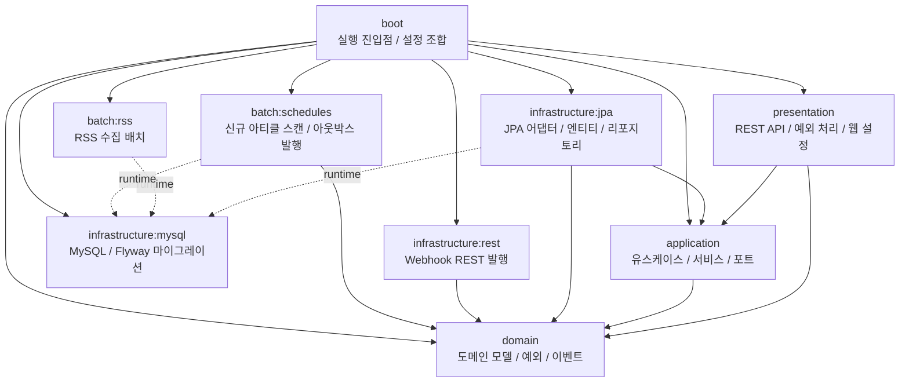

# TechMoa

TechMoa App은 여러 기술 블로그의 RSS를 수집해 아티클을 통합 제공하고, 신규 글 발생 시 웹훅으로 알림을 전달하는 Kotlin + Spring Boot 기반 멀티모듈 백엔드 애플리케이션입니다.

## 핵심 기능

- 여러 기술 블로그 RSS를 수집하고 중복 없이 아티클을 저장합니다.
- 현재까지 약 1,000개의 블로그 아티클을 볼 수 있습니다. 
- 새로운 글이 등록될 때 Discord 웹훅으로 알림을 받을 수 있습니다.

## 멀티모듈 구조

