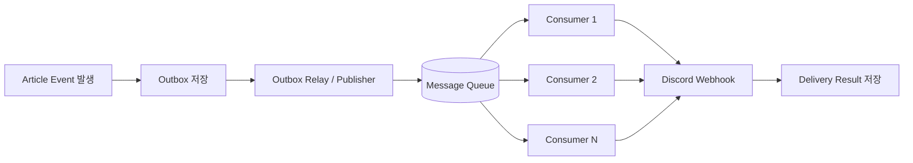

# 디스코드 웹훅 아웃박스 처리량 개선안

## 문제 요약

현재 구조는 아웃박스 테이블의 `PENDING` 레코드를 2분 주기로 10개씩 스캔해서 전송하는 방식이다.  
이 구조에서는 유저 수와 아티클 수가 늘어날수록 `PENDING` 적체가 선형적으로 커지고, 완료까지 걸리는 시간이 급격히 길어진다.

예시로:

- 아티클 `20`개
- 유저 `5000`명
- 총 `PENDING` 레코드 `100000`개
- 처리 속도 `10건 / 2분`

이 경우 전체 처리 완료까지 대략 `13일 21시간`이 걸린다.

즉, 문제의 본질은 "전송 로직이 너무 느리다"기보다 "단위 시간당 병렬로 처리할 수 있는 양이 너무 적다"는 점이다.

---

## 개선 방향의 판단 기준

처리량 개선안을 볼 때는 아래 기준으로 판단하는 것이 좋다.

- 실제 초당/분당 처리량이 늘어나는가
- 버스트 트래픽을 흡수할 수 있는가
- 실패 재시도와 장애 격리가 쉬운가
- 운영 복잡도가 감당 가능한가
- 중복 발송 방지와 순서 보장이 가능한가

---

## 1. Future 구현체를 사용한 병렬 처리

### 개념

스캔한 `PENDING` 레코드를 하나씩 순차 처리하지 않고, `Future`, `CompletableFuture`, 혹은 스레드풀 기반 작업으로 동시에 여러 건 처리하는 방식이다.

### 기대 효과

- 같은 스캔 단위에서 전송 처리 시간을 줄일 수 있다
- 구현 난이도가 비교적 낮다
- 현재 아웃박스 구조를 크게 바꾸지 않고도 적용 가능하다

### 한계

- 병렬 수를 무제한으로 늘리면 외부 디스코드 API rate limit에 걸릴 수 있다
- DB 락 경합, 스레드풀 고갈, 커넥션 풀 부족 문제가 생길 수 있다
- 애플리케이션 인스턴스가 1개면 수평 확장 효과는 제한적이다
- 장애 발생 시 재시도 정책과 중복 발송 방지를 별도로 잘 설계해야 한다

### 결론

가장 빨리 적용할 수 있는 개선안이지만, 장기적으로는 운영 안정성보다 "속도만 올리는" 성격이 강하다.

---

## 2. 소비자 인스턴스를 복수 개로 늘리는 스케일 아웃

### 개념

같은 소비 로직을 여러 인스턴스에서 동시에 실행한다.  
예를 들어 워커를 1개에서 5개로 늘리면, 같은 시간에 더 많은 아웃박스 레코드를 처리할 수 있다.

### 기대 효과

- 가장 직관적인 처리량 증가 방법이다
- 인스턴스 수를 늘리는 것만으로 처리량 확장이 가능하다
- 트래픽 증가에 따라 탄력적으로 대응할 수 있다

### 한계

- 각 인스턴스가 같은 레코드를 집어가지 않도록 분산 락, 상태 선점, SKIP LOCKED 같은 장치가 필요하다
- 인스턴스 수가 늘어나도 외부 API rate limit은 그대로다
- 장애 시 중복 처리 가능성이 커지므로 멱등성 설계가 필수다
- 테이블 스캔 방식이 그대로면 DB 부하도 같이 커진다

### 결론

처리량 자체는 분명히 늘릴 수 있지만, "어떻게 안전하게 분산할 것인가"가 핵심 난제가 된다.

---

## 3. 메시지 큐를 도입해서 Pub/Sub 구조로 만드는 방식

### 핵심 정리

메시지 큐는 그 자체가 처리량을 자동으로 높여주지는 않는다.  
대신 다음 두 가지를 가능하게 한다.

- 생산자와 소비자를 분리해서 버스트를 흡수한다
- 소비자를 수평 확장해서 병렬 처리량을 높인다

즉, 큐는 "처리량 증가의 직접 원인"이라기보다 "처리량을 안정적으로 늘릴 수 있게 해주는 기반"이다.

### 왜 의미가 있는가

현재 구조는 DB 아웃박스 테이블을 주기적으로 훑는 폴링 모델이다.  
이 모델은 레코드가 많아질수록 다음 문제가 커진다.

- 불필요한 테이블 스캔 비용
- 처리 지연
- 스캔 주기 의존성
- 확장 시 락/경합 문제

메시지 큐를 넣으면 아웃박스는 "대기열" 역할에 집중하고, 실제 전송은 큐 컨슈머가 담당하게 만들 수 있다.

### 추천 아키텍처

### 동작 방식

1. 아티클 생성 또는 발행 이벤트가 발생한다.
2. 애플리케이션은 아웃박스 테이블에 전달할 메시지를 `PENDING` 상태로 저장한다.
3. 별도의 퍼블리셔가 아웃박스를 읽어 메시지 큐에 발행한다.
4. 여러 컨슈머가 큐를 구독하면서 디스코드 웹훅을 병렬로 전송한다.
5. 성공 시 `SUCCESS`, 실패 시 재시도 큐 또는 `RETRY` 상태로 이동한다.

### 장점

- 생산과 소비를 분리해 장애 전파를 줄일 수 있다
- 큐 길이로 적체 상황을 관찰하기 쉽다
- 컨슈머 수를 늘려 처리량을 유연하게 조절할 수 있다
- 실패 재처리, DLQ, 지연 재시도 같은 운영 전략을 붙이기 좋다

### 단점

- 시스템 구성요소가 늘어나고 운영 복잡도가 올라간다
- exactly-once 처리는 현실적으로 어렵고, 결국 멱등성이 필요하다
- 중복 발송 방지를 위해 메시지 키, deduplication, idempotency key가 필요하다
- 큐와 DB 상태를 함께 관리해야 하므로 설계 난도가 높다

### 결론

처리량 개선과 운영 안정성을 함께 가져가려면 3번이 가장 설계적으로 낫다.  
특히 "나중에 컨슈머를 여러 개로 늘릴 수 있는 구조"를 만들 수 있어서, 장기 확장성 측면에서 유리하다.

---

## 비교 요약

| 방식 | 처리량 증가 효과 | 구현 난이도 | 운영 안정성 | 확장성 | 추천도 |
| --- | --- | --- | --- | --- | --- |
| Future 병렬 처리 | 중간 | 낮음 | 중간 | 낮음 | 보조안 |
| 소비자 스케일 아웃 | 높음 | 중간 | 중간 | 높음 | 유효한 직접안 |
| 메시지 큐 + Pub/Sub | 높음 | 높음 | 높음 | 매우 높음 | 최종 추천 |

---

## 내가 추천하는 방향

이번 문제를 단순히 "더 빨리 보내기"로 보면 1번이나 2번으로도 일정 수준 해결할 수 있다.  
하지만 장기적으로는 다음 이유로 3번이 더 적절하다.

- 향후 유저 수와 아티클 수 증가를 감당하기 쉽다
- 발송 실패, 재시도, DLQ, 모니터링을 붙이기 좋다
- 스캔 기반 폴링을 점차 줄이고 이벤트 기반으로 이동할 수 있다
- 시스템 경계를 명확히 나눌 수 있다

따라서 경험 목적과 설계 완성도를 같이 생각하면, `3번 메시지큐 도입`을 중심으로 잡는 것이 맞다.

---

## 현실적인 단계적 도입안

1. 먼저 현재 아웃박스 구조는 유지한다.
2. 아웃박스 레코드를 큐로 발행하는 퍼블리셔를 분리한다.
3. 컨슈머에서 디스코드 웹훅 전송을 담당하게 한다.
4. 컨슈머를 여러 개로 늘릴 수 있게 멱등성과 분산 처리를 정리한다.
5. 충분히 안정화되면 테이블 스캔 중심 구조를 축소한다.

---

## 정리

- 1번은 가장 빠른 개선안이다.
- 2번은 처리량을 직접 늘릴 수 있지만 분산 제어가 필요하다.
- 3번은 시스템적으로 가장 안정적으로 확장 가능한 방식이다.

이번 케이스에서는 `3번`을 중심 설계로 잡고, 필요하면 `1번`을 보조 최적화로 섞는 접근이 가장 합리적이다.
