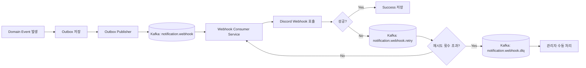

# Kafka vs RabbitMQ 의사결정 보고서

## 배경

현재 목표는 디스코드 웹훅 알림을 아웃박스 기반으로 발행하고, 이를 별도 `sub` 인스턴스에서 소비하는 구조로 바꾸는 것이다.  
지금은 `pub`, `sub` 모두 싱글 인스턴스로 시작하지만, 이후에는 `sub` 인스턴스를 분리하고 수평 확장까지 고려해야 한다.

구현해야 할 기능은 다음과 같다.

- 메시지 발행
- 알림 전송 실패 시 재시도 큐 적재
- 최종 실패 메시지는 DLQ에 적재하여 관리자 수동 관리
- `sub` 인스턴스 분리 및 스케일 아웃 고려

---

## 결론 요약

### 최종 추천

`Kafka`를 선택하는 편이 더 낫다.

### 이유

- `sub`를 별도 서비스로 분리하고, 이후 인스턴스를 늘리는 구조와 잘 맞는다
- 메시지 재처리, 재생(replay), 소비자 그룹 기반 확장이 자연스럽다
- 이번 프로젝트를 통해 Kafka를 학습하고 싶은 목적과도 일치한다

### 단, 중요한 전제

Kafka가 retry/DLQ를 자동으로 잘 해결해주는 것은 아니다.  
오히려 `retry topic`, `DLQ topic`, `attempt count`, `nextRetryAt` 같은 설계를 직접 만들어야 한다.

즉:

- `RabbitMQ`는 이 기능들을 더 쉽게 구현한다
- `Kafka`는 이 기능들을 더 확장성 있게 운영할 수 있다

---

## 비교 기준

이 의사결정은 다음 기준으로 봐야 한다.

- 현재는 싱글 인스턴스지만, 이후 수평 확장이 쉬운가
- 실패 재시도와 최종 실패 관리가 자연스러운가
- 운영과 디버깅이 단순한가
- 메시지 재처리와 replay가 가능한가
- 학습 및 향후 확장 가치가 있는가

---

## Kafka와 RabbitMQ 비교

| 항목 | Kafka | RabbitMQ |
| --- | --- | --- |
| 현재 싱글 인스턴스 운영 | 가능 | 가능 |
| `sub` 분리 후 확장 | 매우 유리 | 유리 |
| 소비자 수평 확장 | 매우 유리 | 유리 |
| 메시지 replay | 매우 유리 | 제한적 |
| retry/DLQ 구현 난이도 | 중간~높음 | 낮음 |
| 작업 큐 의미론 | 중간 | 매우 유리 |
| 운영 복잡도 | 높음 | 중간 |
| 학습 가치 | 높음 | 중간 |

---

## 기능별 적합성

### 1. 메시지 발행

두 제품 모두 가능하다.

- Kafka: 토픽에 이벤트를 append하는 구조라 이벤트 발행 모델에 잘 맞는다
- RabbitMQ: 라우팅과 큐 적재가 직관적이라 작업 발행 모델에 잘 맞는다

이 기능만 놓고 보면 둘 다 충분하다.

### 2. 실패 시 재시도 큐

이 기능은 RabbitMQ가 더 단순하다.

- RabbitMQ는 TTL + DLX 조합으로 지연 재시도 패턴을 만들기 쉽다
- Kafka는 retry topic을 따로 두고, 소비자가 재시도 시점에 맞춰 다시 읽도록 설계해야 한다

즉, retry 자체의 구현 편의성은 RabbitMQ가 좋다.

### 3. 최종 실패 메시지 DLQ

두 제품 모두 가능하지만, 방식이 다르다.

- RabbitMQ: DLX/DLQ 개념이 자연스럽고 설정이 단순하다
- Kafka: `*.dlq` 토픽으로 별도 적재하는 방식이 일반적이다

관리자 수동 관리라는 목적에는 둘 다 잘 맞는다.

### 4. sub 분리와 스케일 아웃

여기서는 Kafka가 더 강하다.

- Kafka는 consumer group으로 여러 인스턴스를 같은 consumer 역할로 묶기 쉽다
- 파티션 수만 충분하면, 소비자 인스턴스를 늘려 병렬 처리량을 키우기 좋다
- 메시지 replay가 쉬워서 운영 중 복구나 재처리에 유리하다

RabbitMQ도 수평 확장이 가능하지만, 이후 이벤트 스트림 관점의 확장성은 Kafka가 더 좋다.

---

## 추천 판단

### RabbitMQ가 더 나은 경우

- 목표가 빠른 구현과 단순한 운영이다
- retry/DLQ를 최소한의 설계로 처리하고 싶다
- 메시지 큐를 거의 작업 큐처럼 쓰고 싶다

### Kafka가 더 나은 경우

- `sub`를 별도 서비스로 분리하고, 이후 인스턴스 확장을 전제로 한다
- 이벤트 재처리와 replay가 중요하다
- 장기적으로 이벤트 스트리밍 구조로 확장할 가능성이 있다
- 이번 기회에 Kafka를 학습하고 싶다

현재 요구를 보면 `Kafka` 쪽이 더 맞다.  
특히 `sub`를 분리하고 스케일 아웃까지 고려하는 순간, 단순 작업 큐보다 이벤트 스트림에 가까운 구조가 되기 때문이다.

---

## 권장 아키텍처

---

## Kafka 설계안

### 토픽 구성

- `notification.webhook`: 정상 발행 토픽
- `notification.webhook.retry`: 재시도 토픽
- `notification.webhook.dlq`: 최종 실패 토픽

### 메시지 키

권장 키는 다음 중 하나다.

- `outboxId`
- `articleId + userId`

중복 방지와 추적성을 생각하면 `outboxId`가 가장 단순하다.

### 메시지 헤더

재시도와 운영 관리를 위해 아래 헤더를 두는 것이 좋다.

- `attempt`
- `nextRetryAt`
- `errorCode`
- `errorMessage`
- `createdAt`

### 소비자 동작

1. `notification.webhook`을 consume한다.
2. 디스코드 웹훅 전송을 시도한다.
3. 성공하면 해당 메시지를 성공 처리한다.
4. 실패하면 `attempt`를 증가시켜 `notification.webhook.retry`로 다시 publish한다.
5. 재시도 횟수가 기준을 넘으면 `notification.webhook.dlq`로 이동한다.

### 재시도 전략

Kafka는 지연 큐가 기본 기능이 아니므로, 아래 중 하나를 선택해야 한다.

- 단계형 retry topic을 둔다
  - 예: `retry.10s`, `retry.1m`, `retry.10m`
- retry consumer가 `nextRetryAt`을 보고 아직 이르면 다시 publish한다

실무적으로는 단계형 retry topic이 단순하고 운영하기 쉽다.

---

## 운영 시 주의점

### 1. 중복 전송 가능성

Kafka든 RabbitMQ든 외부 웹훅 호출은 결국 at-least-once 처리로 가는 것이 현실적이다.  
따라서 디스코드 호출 전에 DB 상태 확인 또는 멱등성 키 기반 관리가 필요하다.

### 2. 파티션 수 계획

Kafka를 선택하면 파티션 수가 중요하다.

- 파티션 수가 너무 적으면 소비자 수를 늘려도 병렬성이 제한된다
- 처음부터 예상 최대 소비자 수보다 넉넉하게 잡는 편이 낫다

### 3. 재시도 폭주

재시도 메시지가 한꺼번에 몰리면 오히려 장애를 키울 수 있다.

- 백오프 전략을 두고
- 실패 원인별로 재시도 여부를 구분하고
- DLQ로 빨리 보내는 기준을 명확히 해야 한다

### 4. 외부 API rate limit

Kafka로 확장해도 디스코드 웹훅 rate limit은 그대로다.  
즉, 큐 처리량과 실제 발송 허용량은 분리해서 생각해야 한다.

---

## 최종 판단

이 프로젝트에서는 `RabbitMQ`가 retry/DLQ 구현은 더 쉽지만,  
`sub` 분리와 향후 스케일 아웃, replay, 이벤트 기반 확장성을 고려하면 `Kafka`가 더 나은 선택이다.

특히 다음 조건이 동시에 맞기 때문이다.

- 지금은 싱글 인스턴스라도, 나중에 소비자를 늘릴 가능성이 높다
- 메시지를 단순 큐가 아니라 이벤트 스트림처럼 다루는 방향이 더 유리하다
- Kafka를 학습하고 싶은 목적이 있다

따라서 이번 구조는 `Kafka`를 채택하고, retry/DLQ는 토픽 분리로 직접 설계하는 방향을 추천한다.

---

## 한 줄 결론

기능 구현의 단순함만 보면 `RabbitMQ`,  
미래의 `sub` 분리와 스케일 아웃, replay, 학습 목적까지 포함하면 `Kafka`가 더 나은 선택이다.
